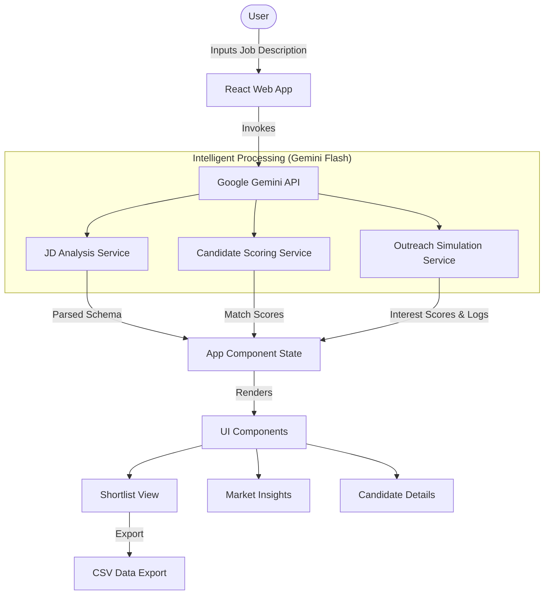

# TalentScout AI - System Architecture

This document outlines the technical architecture and data flow of TalentScout AI.

## 🏗️ Architecture Diagram



## 🧠 Scoring & Matching Logic

TalentScout AI utilizes a multi-dimensional scoring engine powered by Large Language Models (LLMs). Unlike traditional keyword matching, our system evaluates semantic alignment and behavioral indicators.

### 1. Technical Fit Score (0-100)
- **Methodology**: The system compares the candidate's `skills`, `experienceYears`, and `bio` against the extracted `requiredSkills` and `keyResponsibilities` from the job description.
- **Factor Weights**:
    - **Skill Overlap**: Direct matches on essential technologies.
    - **Seniority Alignment**: Comparison of candidate years of experience vs. JD requirements.
    - **Project Relevance**: Semantic evaluation of past projects and achievements mentioned in the bio.

### 2. Cultural Fit Score (0-100)
- **Methodology**: Evaluates the candidate's professional values and communication style against the implicitly defined "company vibe" or explicit mentions of "values" in the JD.
- **Factor Weights**:
    - **Values Alignment**: Does the candidate prioritize innovation, stability, or speed?
    - **Communication Clarity**: Professionalism and tone detected in the bio and simulated conversations.

### 3. Interest Score (0-100)
- **Methodology**: An autonomous agent conducts a simulated outreach.
- **Logic**: Rejections, hesitations, or enthusiastic queries about the tech stack are analyzed to determine the likelihood of the candidate accepting an offer.

---

## 📥 Sample Input/Output

### Sample Input (Job Description)
> "We are looking for a Senior Frontend Engineer with 5+ years of experience in React, TypeScript, and modern CSS. You will lead the development of our core web platform and mentor junior developers."

### Sample Output (Extracted JD Intelligence)
```json
{
  "title": "Senior Frontend Engineer",
  "requiredSkills": ["React", "TypeScript", "Modern CSS"],
  "experienceLevel": "Senior (5+ years)",
  "keyResponsibilities": ["Lead development of core web platform", "Mentor junior developers"]
}
```

### Sample Output (Candidate Evaluation)
```json
{
  "name": "Sarah Chen",
  "matchScore": {
    "technicalFit": 95,
    "culturalFit": 88,
    "overall": 92,
    "explanation": "Sarah has 8 years of deep React experience and has led teams before, making her a perfect fit for the lead role requirements."
  }
}
```
